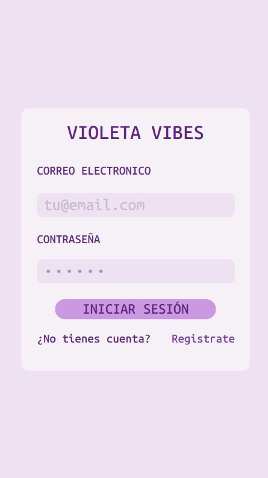
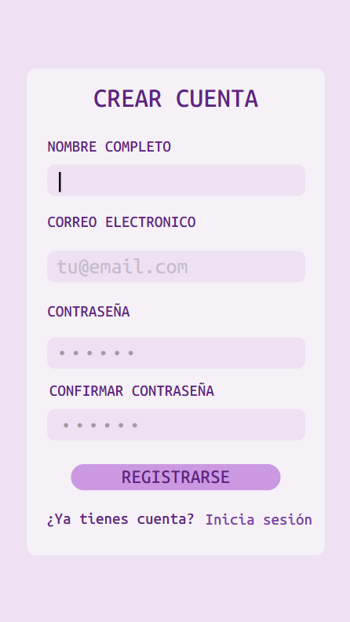
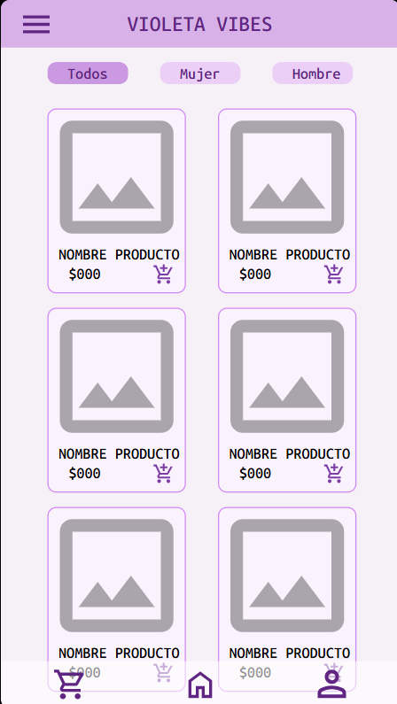
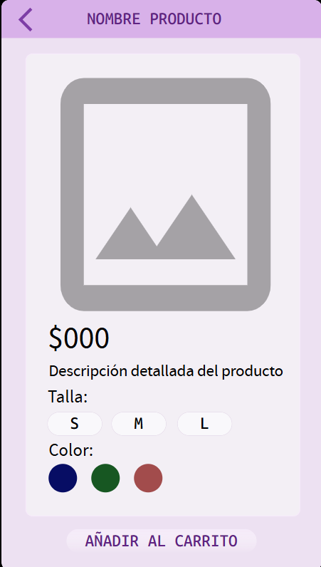
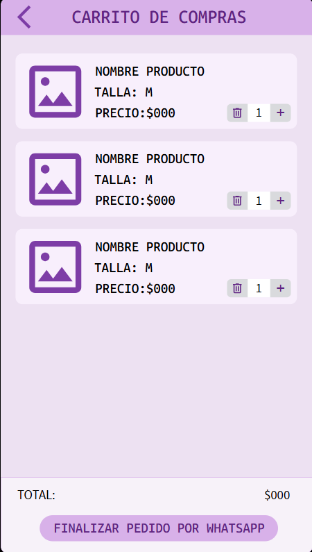
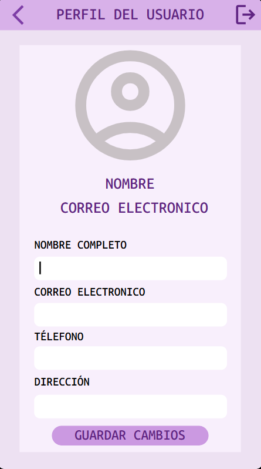

# Diseño de interfaz de usuario

La aplicación tendrá la siguientes pantallas

# Pantalla 1: Loguin
   

---

# Pantalla 2: Registro
 

---

# Pantalla 3: Catalogo
   
   

---

# Pantalla 4: Detalles productos
   
  

---

# Pantalla 5: Carrito de compras
   
 

---

# Pantalla 6: Perfil del usuario
    

---

# Referencias

- [Material Design: Foundations](https://m3.material.io/foundations)
- [Material Design: Style](https://m3.material.io/styles)
